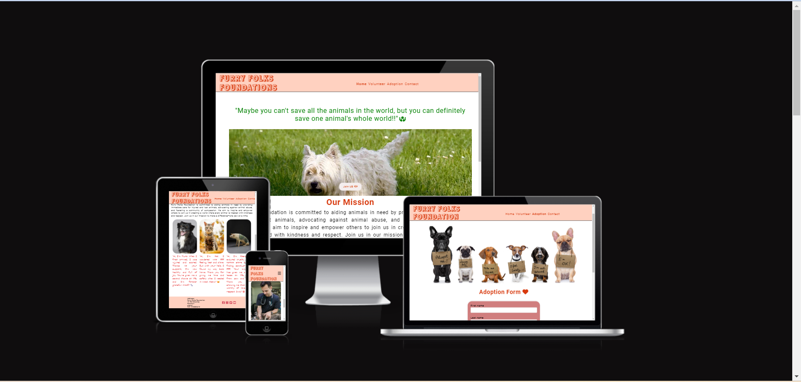
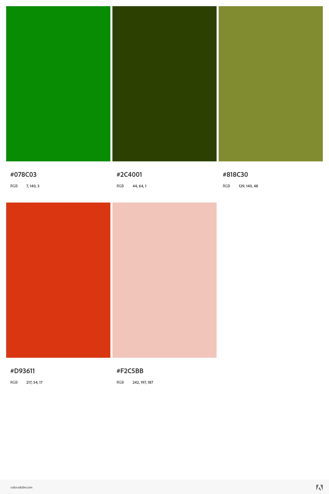
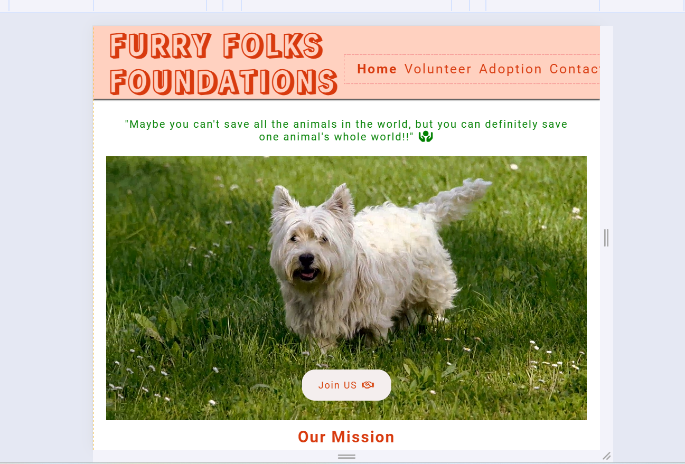

# Furrry Folks Foundation - Website

# Introduction
Project Portfolio 1 for Code Institute's Diploma in Full Stack Software Development program: HTML/CSS Essentials

Welcome to the Furry Folks Foundation website! Our mission is to provide support and resources for furry friends and their owners. Whether you're looking for information on pet care, adoption services, or community events, you'll find it all here. The website is interactive and user-friendly allowing the user to interact with the company through a contact form, adoption form and social media channels.

To get started with the Furry Folks Foundation website, simply visit https://mouneeshwarip.github.io/furry-folks-foundation/. From there, you can explore all the features and resources available. 

## README Table Content

* [Introduction](#introduction)
* [User Experience UX](#user-experience---UX)
    * [User stories](#user-stories)
* [Design](#Design)
        
    * [Website Structure](#website-structure)
    * [Colour Scheme](#colour-scheme)
    * [Typography](#typography)
    * [Imagery](#imagery)
    * [Videos](#videos)
    * [interactive Links](#interactive-links) 
* [Features](#features)  
    * [Home Page Header](#home-page-header)
    * [video with quote](#video-and-quote)
    * [About Section](#aboutus-section)
    * [success stories](#stories by rescued animals) 
    * [Footer Section](#footer-section)
    * [Volunteer Page](#Volunteer-page)
    * [Adoption Page](#Adoption-page)
    * [Contact Page](#Contact-page)
    * [Thanks Page](#thanks-page)
* [Future Features](#future-features)
    * [Virtual Adoption Events](#virtual-adoption-events)
    * [Online Pet Training Classes](#Online-Pet-Training-Classes)
* [Technologies Used](#technologies-used)
    * [Languages Used](#languages-used)
    * [Frameworks - Libraries - Programs Used](#frameworks---libraries---programs-used)
* [Testing](#testing)
    * [Bugs](#bugs)
    * [Website Development Issues](#website-development-issues)
* [Deployment](#deployment-this-project)
    * [Deployment This Project](#deployment-this-project)
    * [Forking This Project](#forking-this-project)
    * [Cloning This Project](#cloning-this-project)
* [Credits](#credits)
* [Content](#content)

## User Experience - UX

 ### User Stories

* As a website creator, I want to:
1. Design a visually appealing website that conveys the mission and values of the Furry Folks Foundation, encouraging visitors to engage with our cause.
2. Create an intuitive and user-friendly navigation system that allows users to easily access information about pet adoption, volunteering services, community events, and donation opportunities.

* As a business owner, I want to:

1. Ensure sustainability: Plan for the long-term success of the foundation.
2. Foster community engagement: Create events that bring pet owners and supporters together.
3. Maintain financial stability: Secure diverse revenue streams for ongoing support.

* As a visitor, I want to:

1. Navigate effortlessly through the website to learn about available pet adoption opportunities, educational resources, and ways to get involved.
2. Find easily accessible contact information to inquire about pet adoption, volunteering, or making donations.
   
## Design

### Website Structure
Furry Folks Foundation website is a five pages site: Home Page, Volunteer Page, Adoption Page, Contact Page and Thanks Page. The default loading page is the Home Page and it is linked to the other pages by a button. The Home Page has 6 sections: (1) 
Header, (2) Quote section, (3) Hero video , (4) About us section, (5) success stories, (6) Footer. This page, is linked to all the pages in the website by the Navigation Menu on the top. The Volunteer Page has the Menu at the top and 2 sections: (1) Volunteer opportunities , (2) Volunteer Experiences (3) Footer. The Adoption page has 3 sections (1) Banner (2) Adoption Form (3)Footer. The Contact Page has 2 sections (1) Contact Form (2) Footer. The Thanks Page has two sections: (1) 'Thanks' message and (2) Footer.

#### Colour Scheme
 
 The choice of colors, including green, orange, pink and their variants, serves to create a cohesive and visually appealing design that aligns with the mission of promoting animal welfare. Green symbolizes nature, growth, and harmony, which are key themes in animal welfare. Orange symbolizes enthusiasm, optimism, and creativity, reflecting the passion and dedication of those involved in animal welfare efforts. Pink symbolizes compassion, love, and affection, mirroring the care and empathy shown towards animals.

#### Typography
* Roboto, sans-serif is the main font for the whole website.
* Rampart One, sans-serif is the logo font in the header.
* Schoolbell, sans-serif is the playful font for animal side stories to add some extra touch and friendly approach.
         
#### Imagery
* Three images are used on the home page with easily loadable file sizes.
* Four images are used on the volunteer page to provide more details about volunteer opportunities and happy experiences.
* One banner image is used on the adoption page.
* All images are JPEG files with easily loadable sizes.

###  Videos
* The Home Page features a video of a dog walking, set to display with muted audio, looping seamlessly, and autoplaying upon page load.

### Interactive Links  

* At the bottom of the Home Page and in the footer, users can access the social media links (Facebook and Twitter). Clicking on these icons opens the respective social media platforms in a new tab.
* On the video, clicking the "Join Us" button directly redirects users to the volunteer page for further engagement.

## Features

### Home Page 

* The Home Page is the initial gateway to our website, featuring a captivating animal video and an emotional slogan aimed at fostering connection and empathy. A prominent "Join Us" button invites immediate action, guiding users to explore further. Heartwarming animal stories and essential navigation links complete the immersive experience.   
[Live Page Here](https://mouneeshwarip.github.io/furry-folks-foundation/index.html)

### Navigation Menu

* At the top of the website, users can find a fixed navigation menu that is fully responsive in all devices. In this navigation menu users can navigate to the different pages in the website. They can also see the Travel World logo on the left side.  
[Live Feature Here](https://pedrocristo.github.io/portfolio_project_1/home.html)

### Home Page Header

* In this feature users can see a travel image as a background followed by some services provided by the company. It is advertising cost savings to the user by booking a trip with Travel World.  
[Live Page Here](https://pedrocristo.github.io/portfolio_project_1/home.html)

### About Section

* In this feature users have access to information about the company, for example the company's main purpose, its history, mission statement, and also the benefits of working for Travel World.  
[Live Feature Here](https://pedrocristo.github.io/portfolio_project_1/home.html#about-section)

### Banner Section 1 - Bali

* This feature is a highlight banner where the user can see a travel deal and book the trip by clicking on ' Book now' and it will allow the user to ring the  
  Travel World office. 
[Live Feature Here](https://pedrocristo.github.io/portfolio_project_1/home.html#banner-bali)

### Top Trips Section

* This feature is a cards section where the top travel deals are displayed with information about the city, country, price, hotel name, hotel stars and duration of stay (number of days and nights). The card has a button where the user can book. When the user hovers over this, the box-shadow changes. 
[Live Feature Here](https://pedrocristo.github.io/portfolio_project_1/home.html#top-trips)

### Banner Section 2 - Maldives 

* This feature has the same purpose as the Top Trip Section. A modification to this section is when the user hovers over the card the user can zoom in on the image. 
[Live Feature Here](https://pedrocristo.github.io/portfolio_project_1/home.html#banner-maldivas)

### City Breaks Section

* This feature has the same purpose as the Top Trip Section. The difference  is when the card is hovered by the user the image zoom in. 
[Live Feature Here](https://pedrocristo.github.io/portfolio_project_1/home.html#city-trips)

### Partners Section

* In this section users can see partners and companies that Travel World work with. 
[Live Feature Here](https://pedrocristo.github.io/portfolio_project_1/home.html#partners-section)

### Footer Section

* This feature is called the Footer Section. Here users can see information about the company's schedule and contact Travel World through the social media links. The copyright message is displayed on the bottom. 
[Live Feature Here](https://pedrocristo.github.io/portfolio_project_1/home.html#footer)

### Contact Page

* In this page users can contact the Travel World via a contact form. The contact form requires the user's first name, last name, email and message. The user can also see the location of the Travel World office on Google Maps. 
[Live Feature Here](https://pedrocristo.github.io/portfolio_project_1/contact.html)

### Thanks Page

* Once the user successfully submits a contact form, they will land on the 'Thanks' Page. When the button is clicked it brings the users back to the contact form. 
[Live Feature Here](https://pedrocristo.github.io/portfolio_project_1/thanks-page.html)

## Future Features
  
### Customer Review Section

* Add a Customer Review Section in the Home page. This would allow users to offer suggestions on how to improve the website and display customers' experiences and their opinions of Travel World.

## Technologies Used

### Languages Used 

* [HTML5](https://en.wikipedia.org/wiki/HTML5).
* [CSS3](https://en.wikipedia.org/wiki/Cascading_Style_Sheets).
* [Bootstrap](https://getbootstrap.com/).

### Frameworks - Libraries - Programs Used

* [Google Fonts:](https://fonts.google.com/)
   * Google fonts were used to import the 'Poppins' and 'El Messiri' fonts throughout the style.css.
* [Font Awesome:](https://fontawesome.com/)
    * Font Awesome are used as an icons for user UX purposes.
* [Git](https://git-scm.com/)
    * Git was used for version control by utilizing the Gitpod terminal to commit to Git and Push to GitHub.
* [GitHub:](https://github.com/)
    * GitHub is used to store the project's code after being pushed from Git.
* [PIXLR:](https://pixlr.com/pt/)
    * PIXLR was used to create, modify and resize all images on this website.
* [Canva](https://www)
    * Canva was used to creat the image logo, favicon and also the office image.
  
## Testing

The W3C Markup Validator and W3C CSS Validator Services were used to validate every page of the project to ensure there were no syntax errors in the project.

* [W3C Markup Validator](https://validator.w3.org/#validate_by_input) - [Website Results](https://validator.w3.org/nu/?doc=https%3A%2F%2Fpedrocristo.github.io%2Fportfolio_project_1%2Findex.html)
* [W3C CSS Validator](https://jigsaw.w3.org/css-validator/#validate_by_input) - [Website Results](https://jigsaw.w3.org/css-validator/validator?uri=https%3A%2F%2Fpedrocristo.github.io%2Fportfolio_project_1%2Findex.html&profile=css3svg&usermedium=all&warning=1&vextwarning=&lang=en).

Google Lighthouse was used to test Performance, Best Practices, Accessibility and SEO on both Desktop and Mobile devices.

The testing was done using the Google Chrome Browser. Chrome Developer Tools was used extensively, particularly to check responsiveness on different screen sizes. Testing was also done using Firefox on desktop, and again on Google Chrome and Opera on the Huawei P20.

* Responsive on all device sizes between 280px - 2600px wide

* Devices tested using the Google Developer Tools emulator

    * BlackBerry Z30 (360px x 640px)  
    * BlackBerry PlayBook (600px x 1024px)  
    * Samsung Galaxy Note 3 (360px x 640px) 
    * Samsung Galaxy S3 (360px x 640px)   
    * Samsung Galaxy S9+(320px x 658px) 
    * LG Optimus L70 (384px x 640px)
    * Microsoft Lumia 550 (640px x 360px) 
    * Microsoft Lumia 950 (360px x 640px) 
    * Nexus 4 (384px x 640px) 
    * Nokia Lumia 520 (320px x 533px) 
    * Nokia N9 (480px x 854px) 
    * Pixel 3 (393px x 786px)
    * Apple iPad Mini (468px x 4024)
    * Apple iPhone 4 (320px x 480px)
    * Apple iPhone 5/S (320px 568px)
    * Apple iPhone 6/7/8 (375px x 667px)
    * Apple iPhone 6/7/8 Plus (414px x 736px)
    * Apple iPhone X (375px x 812px)

* Desktop Results:

  .

* Mobile Results:

  .

   ## Functionality
* All links have been hovered and clicked to ensure accessibility.
* Pages all load correctly on all device screen sizes.
* All social media links work correctly and open on a new tab.
* All images load on each page as intended.
* All the buttons are working correctly and bring the users to the function that they were built for.
* The arrows inside the buttons in Landing Page, Thanks Page and Homepage banners, has a fully functional opacity animation.
* Both the buttons in Homepage cards and in the Contact Page change the background and text color when hovered by the user. They are working without issues.
* The cards in the Homepage "top trips", change the box shadow when hovered by the user, working correctly.
* The cards in the Homepage "city breaks", has an image zoom in effect when hovered by the users, working correctly.

   ## Bugs

* I was unable to add padding to the arrow default in the form select.

   ## Website Development Issues

* At the initial stages of my project, I made an error when using Git Commit. Following my first call with my mentor he clarified how to do it and I have followed his recommended approach.

## Deployment of This Project

The website development was created in the "main" branch. This branch was deployed using GitHub Pages.

* This site was deployed by completing the following steps:

1. Open [GitHub](https://github.com/).
2. Click on the project to be deployed.
3. Navigate to the "Settings".
4. Navigate down to the "GitHub Pages".
5. Click on "Check it out here!".
6. Select the "main" branch and select "Save".
7. The link to the live website was ready on the top.

## Forking This Project

* Fork this project following the steps:

1. Open [GitHub](https://github.com/).
2. Click on the project to be forked.
3. Find the 'Fork' button to the top right of the page.
4. Once you click the button the fork will be in your repository..

## Cloning This Project

* Clone this project following the steps:

1. Open [GitHub](https://github.com/).
2. Click on the project to be cloned.
3. You will be provided with three options to choose from, HTTPS, SSH or GitHub CLI, click the clipboard icon in order to copy the URL..
4. Once you click the button the fork will be in your repository.
5. Open a new terminal.
6. Change the current working directory to the location that you want the cloned directory.
7. Type 'git clone' and paste the URL copied in step 3.
8. Press 'Enter' and the project is cloned.

## Credits

### Information Sources/Resources

* [W3Schools](https://www.w3schools.com/).

* [Stack Overflow](https://stackoverflow.com/).
  

## Content

* All the text content is original. The quote in the footer is from [Andre Gide](https://www.brainyquote.com/quotes/andre_gide_120088).

### Images

* All images were provided and used under the Unsplash licence [Unsplash.com](https://unsplash.com/license).

### Video

* The video was provided and used under the Pexels licence [Unsplash.com](https://www.pexels.com/video/aerial-view-of-an-infinity-pool-in-maldives-beach-resorts-4069480/).

### Trust Section Icons

* All the icons were provided and used under the Icons8 licence [Icons8.com](https://icons8.com/icons/set/best-price).
  
## Special Thanks

 * Special thanks to my mentor Sandeep Aggarwal, my colleagues at Code Institute, Kasia Bogucka and Mairéad Gillic for their assistance throughout this project.
