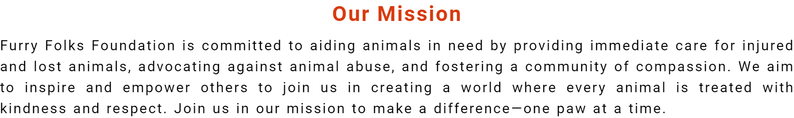
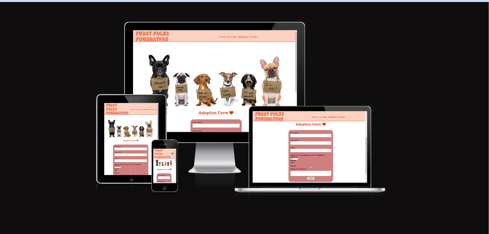

# Furrry Folks Foundation - Website

# Introduction
Project Portfolio 1 for Code Institute's Diploma in Full Stack Software Development program: HTML/CSS Essentials

Welcome to the Furry Folks Foundation website! Our mission is to provide support and resources for furry friends and their owners. Whether you're looking for information on pet care, adoption services, or community events, you'll find it all here. The website is interactive and user-friendly allowing the user to interact with the company through a contact form, adoption form and social media channels.

To get started with the Furry Folks Foundation website, simply visit https://mouneeshwarip.github.io/furry-folks-foundation/. From there, you can explore all the features and resources available. 

## README Table Content

* [Introduction](#introduction)
* [User Experience UX](#user-experience---UX)
    * [User stories](#user-stories)
* [Design](#Design)
        
    * [Website Structure](#website-structure)
    * [Colour Scheme](#colour-scheme)
    * [Typography](#typography)
    * [Imagery](#imagery)
    * [Videos](#videos)
    * [interactive Links](#interactive-links) 
* [Features](#features)  
    * [Home Page Header](#home-page-header)
    * [Home Page](#home-page)
    * [Our Mission Section](#Our Mission-section)
    * [Footer Section](#footer-section)
    * [Volunteer Page](#Volunteer-page)
    * [Adoption Page](#Adoption-page)
    * [Contact Page](#Contact-page)
    * [Thanks Page](#thanks-page)
* [Future Features](#future-features)
    * [Virtual Adoption Events](#virtual-adoption-events)
    * [Online Pet Training Classes](#Online-Pet-Training-Classes)
* [Technologies Used](#technologies-used)
    * [Languages Used](#languages-used)
    * [Frameworks - Libraries - Programs Used](#frameworks---libraries---programs-used)
* [Testing](#testing)
    * [Bugs](#bugs)
    * [Website Development Issues](#website-development-issues)
* [Deployment](#deployment-this-project)
    * [Deployment This Project](#deployment-this-project)
    * [Forking This Project](#forking-this-project)
    * [Cloning This Project](#cloning-this-project)
* [Credits](#credits)
* [Content](#content)

## User Experience - UX

 ### User Stories

* As a website creator, I want to:

1. Design a visually appealing website that conveys the mission and values of the Furry Folks Foundation, encouraging visitors to engage with our cause.
2. Create an intuitive and user-friendly navigation system that allows users to easily access information about pet adoption, volunteering services, community events, and donation opportunities.

* As a business owner, I want to:

1. Ensure sustainability: Plan for the long-term success of the foundation.
2. Foster community engagement: Create events that bring pet owners and supporters together.
3. Maintain financial stability: Secure diverse revenue streams for ongoing support.

* As a visitor, I want to:

1. Navigate effortlessly through the website to learn about available pet adoption opportunities and ways to get involved.
2. Find easily accessible contact information to inquire about pet adoption, volunteering, or making donations.

* As a returning visitor, I want to:

1. Engage with adoption and volunteering activities by filling the respective forms and providing my data for the same.

## Design

### Website Structure
Furry Folks Foundation website is a five pages site: Home Page, Volunteer Page, Adoption Page, Contact Page and Thanks Page. The default loading page is the Home Page and it is linked to the other pages by a button. The Home Page has 6 sections: (1) Header, (2) Quote section, (3) Hero video , (4) Our Mission section, (5) success stories, (6) Footer. This page, is linked to all the pages in the website by the Navigation Menu on the top. The Volunteer Page has the Menu at the top and 4 sections: (1) Header (2) Volunteer opportunities , (3) Volunteer Experiences (4) Footer. The Adoption page has 4 sections: (1) Header (2) Banner (3) Adoption Form (4)Footer. The Contact Page has 3 sections: (1) Header (2) Contact Form (3) Footer. The Thanks Page has 3 sections: (1) Header (2) 'Thanks' message and (3) Footer.

#### Colour Scheme
 
 The choice of colors, including green, orange, pink and their variants, serves to create a cohesive and visually appealing design that aligns with the mission of promoting animal welfare. Green symbolizes nature, growth, and harmony, which are key themes in animal welfare. Orange symbolizes enthusiasm, optimism, and creativity, reflecting the passion and dedication of those involved in animal welfare efforts. Pink symbolizes compassion, love, and affection, mirroring the care and empathy shown towards animals.

#### Typography
* Roboto, sans-serif is the main font for the whole website.
* Rampart One, sans-serif is the logo font in the header.
* Schoolbell, sans-serif is the playful font for animal side stories to add an innocent child-like touch and friendly approach.
         
#### Imagery
* Three images are used on the home page with easily loadable file sizes.
* Four images are used on the volunteer page to provide more details about volunteer opportunities and happy experiences.
* One banner image is used on the adoption page.
* All images are JPEG files with easily loadable sizes.

###  Videos
* The Home Page features a video of a dog walking, set to display with muted audio, looping seamlessly, and autoplaying upon page load.

### Interactive Links  

* At the bottom of the Home Page and in the footer, users can access the social media links (Facebook, Instagram, Youtube and Twitter). Clicking on these icons opens the respective social media platforms in a new tab.
* On the video, clicking the "Join Us" button directly redirects users to the volunteer page for further engagement.

## Features

### Home Page Header 
[Home Page Header](assets/images-and-videos/header.png)

* The header of the Home Page prominently displays the Furry Folks Foundation(FFF) logo alongside the navigation menu, providing users with easy access to explore the website.

### Home Page 

* The Home Page is the initial gateway to our website, featuring a captivating animal video and an emotional slogan aimed at fostering connection and empathy. A prominent "Join Us" button invites immediate action, guiding users to explore further. Heartwarming animal stories and essential navigation links complete the immersive experience.   
[Live Page Here](https://mouneeshwarip.github.io/furry-folks-foundation/index.html)

###  Our Mission section

* The "Our Mission" section is dedicated to conveying our mission and values, providing visitors with insight into the core principles that drive our organization's work. Through concise and engaging content, we strive to articulate our commitment to animal welfare and outline the goals we aim to achieve. This section serves as a window into our ethos, fostering trust and connection with our audience.

### Footer

* In the footer section, users can find our contact information, including our address and phone number, facilitating easy communication with our team. Additionally, we provide links to our social media platforms, enabling visitors to stay updated on our latest news and initiatives and fostering a sense of community engagement.

### Volunteer Page

* On the Volunteer page, two vibrant images featuring animals are paired with playful "kids" font style, expressing the animals' desire for volunteers to assist with services such as cleaning and dog walking. These images aim to engage visitors and evoke a sense of joy and responsibility.

* Following this, two additional images showcase volunteers sharing their experiences, adding a personal touch to the page. These images serve to inspire potential volunteers by highlighting the meaningful connections and rewarding experiences that volunteering with us can offer.

### Adoption Page

* The Adoption page features a captivating banner image showcasing animals ready for adoption, inviting visitors to explore the possibilities of welcoming a new furry friend into their homes. Below the banner, a user-friendly adoption form awaits, allowing prospective adopters to provide essential information.

* Upon submitting the adoption form, users are seamlessly redirected to a Thank You page, expressing our gratitude for their interest in adopting and providing reassurance that their submission has been received. This page serves as a warm acknowledgment of their commitment to giving an animal a loving home.

### Contact Page

* The Contact page offers users a convenient contact form, enabling them to submit their details for communication purposes effortlessly. This form serves as a streamlined way for visitors to reach out to us with inquiries, feedback, or any other communication needs. By providing a user-friendly interface, we aim to facilitate seamless interaction and ensure that users can easily connect with our team.

### Thanks Page

* Upon submitting the adoption or contact form, users will be directed to the Thank You page, where they will receive a warm acknowledgment for their submission and their interest in our organization. This page serves as a gesture of appreciation, reassuring users that their messages have been received and highlighting our gratitude for their engagement with us.

## Future Features

### Virtual Adoption Events 

 * Through video conferencing technology, users can schedule virtual meet-and-greet sessions with adoptable animals, facilitating meaningful interactions and helping them make informed adoption decisions.
   
  
### Online Pet Training classes

* Online Pet Training Classes! Access expert-led training sessions conveniently from home. Stay tuned for a tailored curriculum designed to enhance your bond with your furry friend.

## Technologies Used

### Languages Used 

* HTML is used to create the stucture of the website and
* CSS is used to style the site.

### Frameworks - Libraries - Programs Used

* [Google Fonts:](https://fonts.google.com/)
   * Google fonts were used to import the 'Roboto', 'Schoolbell' and 'Rampart One' fonts throughout the style.css.
* [Font Awesome:](https://fontawesome.com/)
    * Font Awesome are used as an icons for user UX purposes.
* [Git](https://git-scm.com/)
    * Git was used for version control by utilizing the Gitpod terminal to commit to Git and Push to GitHub.
* [GitHub:](https://github.com/)
    * GitHub is used to store the project's code after being pushed from Git.
* [PIXLR:](https://pixlr.com/pt/)
    * PIXLR was used to create, modify and resize all images on this website.
* [Canva](https://www)
    * Favicon Generator was used to create favicon.
## Testing

The W3C Markup Validator and W3C CSS Validator Services were used to validate every page of the project to ensure there were no syntax errors in the project.

* [W3C Markup Validator](https://validator.w3.org/#validate_by_input) - [Website Results](https://validator.w3.org/nu/?doc=https%3A%2F%2Fmouneeshwarip.github.io%2Ffurry-folks-foundation%2F)
* [W3C CSS Validator](https://jigsaw.w3.org/css-validator/#validate_by_input) - [Website Results](https://jigsaw.w3.org/css-validator/validator?uri=https%3A%2F%2Fmouneeshwarip.github.io%2Ffurry-folks-foundation%2F&profile=css3svg&usermedium=all&warning=1&vextwarning=&lang=en)

Google Lighthouse was used to test Performance, Best Practices, Accessibility and SEO on both Desktop and Mobile devices.

The testing was done using the Google Chrome Browser. Chrome Developer Tools was used extensively, particularly to check responsiveness on different screen sizes. Testing was also done using Firefox on desktop, and again on Google Chrome.
* Responsive on all device sizes.

   ## Functionality
* All links have been hovered and clicked to ensure accessibility.
* Pages all load correctly on all device screen sizes.
* All social media links work correctly and open on a new tab.
* All images load on each page as intended.
* All the buttons are working correctly and bring the users to the function that they were built for.
* All the buttons in Homepage, adoption page and in the Contact Page change the background and text color when hovered by the user. They are working without issues.

   ## Bugs

* Navbar Menu Adjustment: Initially, I encountered difficulty adjusting the navbar menu without it dropping. However, through debugging, I successfully resolved this issue, ensuring smooth navigation for users.

* Large Image and Video Sizes: Another challenge arose when images and videos appeared excessively large. With guidance from my mentor, I tackled this issue effectively, optimizing the sizes to enhance website performance and user experience.
   
   ## Website Development Issues

* The website was not properly responsive in iPad view. After thorough testing and adjustments, the responsive design issues were resolved, ensuring a consistent user experience across devices.

## Deployment of This Project

The website development was created in the "main" branch. This branch was deployed using GitHub Pages.

* This site was deployed by completing the following steps:

1. Open [GitHub](https://github.com/).
2. Click on the project to be deployed.
3. Navigate to the "Settings".
4. Navigate down to the "GitHub Pages".
5. Click on "Check it out here!".
6. Select the "main" branch and select "Save".
7. The link to the live website was ready on the top.

## Forking This Project

* Fork this project following the steps:

1. Open [GitHub](https://github.com/).
2. Click on the project to be forked.
3. Find the 'Fork' button to the top right of the page.
4. Once you click the button the fork will be in your repository..

## Cloning This Project

* Clone this project following the steps:

1. Open [GitHub](https://github.com/).
2. Click on the project to be cloned.
3. You will be provided with three options to choose from, HTTPS, SSH or GitHub CLI, click the clipboard icon in order to copy the URL..
4. Once you click the button the fork will be in your repository.
5. Open a new terminal.
6. Change the current working directory to the location that you want the cloned directory.
7. Type 'git clone' and paste the URL copied in step 3.
8. Press 'Enter' and the project is cloned.

## Credits

### Information Sources/Resources

* [W3Schools](https://www.w3schools.com/).

* [Stack Overflow](https://stackoverflow.com/).

* Some Youtube videos
  

## Content

* All the text content is original. 
### Images

* All images used in the Furry Folks Foundation website were sourced from Google Images and Pexels. Below are the addresses (URLs) of the image sources:

Google Images: (https://www.google.com/imghp)
Pexels: (https://www.pexels.com/)
### Video

* The video used in the Furry Folks Foundation website was sourced from Pexels Videos. Below is the address (URL) of the video source:

Pexels Videos: (https://www.pexels.com/videos/)
### Icons

*All icons used in the Furry Folks Foundation website were sourced from FontAwesome ( https://fontawesome.com/).
  
## Special Thanks

 * Mentor: A heartfelt thanks to my mentor who supported right from getting the first ideas in place to  the last stages of my project helping me debugging the final errors being a constant source of motivation throughout.

 * My husband and my son: For providing incredible support and encouragement throughout the development process.
 
 * Fellow students: For their collaboration, feedback, and camaraderie during the project journey.
 